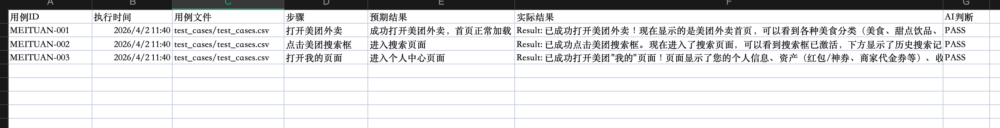

# Android 自动化AI判定测试项目
基于 ModelScope AutoGLM + 大模型AI判定的 Android APP 自动化UI测试工具

## 项目展示
### 演示视频
项目完整操作演示：https://www.bilibili.com/video/BV1zh9TBXEGH/

### 运行截图

## 项目介绍
本项目依托AI大模型自动完成Android手机操作，无需编写控件定位代码，通过读取CSV测试用例，自动执行操作步骤、获取界面结果，并由AI完成PASS/FAIL判定，最终生成可在Excel中正常查看的测试报告，同时支持自动设置与恢复设备分辨率。

适用场景：APP快速冒烟测试、UI功能验证、自动化回归测试。

## 整体架构流程
1. 读取测试用例：从test_cases.csv中加载用例ID、执行步骤、预期结果
2. 分辨率配置：自动设置测试专用分辨率，脚本结束后恢复原始分辨率
3. AI执行操作：调用AutoGLM模型驱动手机完成对应操作
4. 结果提取：从返回信息中截取有效执行结果
5. AI智能判定：对比预期与实际结果，自动判断用例是否通过
6. 报告生成：生成带时间戳的CSV测试报告
7. 环境清理：删除临时文件，恢复手机显示配置

## 项目文件结构
- auto_test.sh：主测试执行脚本
- config.sh：本地隐私配置文件，不上传GitHub
- run.sh：一键启动脚本
- assets/：存放项目截图、演示视频
- test_cases.csv：测试用例配置文件
- execution_logs/：脚本运行日志目录
- test_reports/：自动化测试报告目录

## 核心功能
✅ 批量读取CSV格式测试用例
✅ AI自动操控手机，无需编写自动化代码
✅ 大模型自动判定测试结果
✅ 自动设置/恢复设备分辨率
✅ 生成CSV报告，兼容Excel无异常显示
✅ 密钥本地存储，保障信息安全
✅ 完整日志记录，便于问题排查

## 环境依赖
1. 配置ADB环境，并开启手机USB调试
2. Python3运行环境
3. 依赖curl、sed、awk等基础工具
4. 拥有可用的ModelScope Token与AI判定模型密钥

## 使用方法
### 1. 配置AutoGLM环境，参考[AutoGLM使用说明](./README_AutoGLM.md)

### 2. 配置本地信息
新建config.sh文件，填写个人API信息
export AUTOGLM_KEY="你的ModelScope Token"
export AI_API_KEY="你的AI判定接口Key"
export AI_MODEL="你的模型ID"

### 3. 加载配置信息
source config.sh

### 4. 编写测试用例
编辑test_cases.csv，格式如下：
用例ID,步骤,预期结果
APP-001,打开应用,成功进入应用首页
APP-002,点击我的,成功进入个人中心页面

### 5. 一键执行测试
./run.sh test_cases.csv

## 报告说明
测试报告生成在test_reports目录下，包含字段：
- 用例ID
- 执行时间
- 测试步骤
- 预期结果
- 实际执行结果
- AI判定结果（PASS/FAIL）

